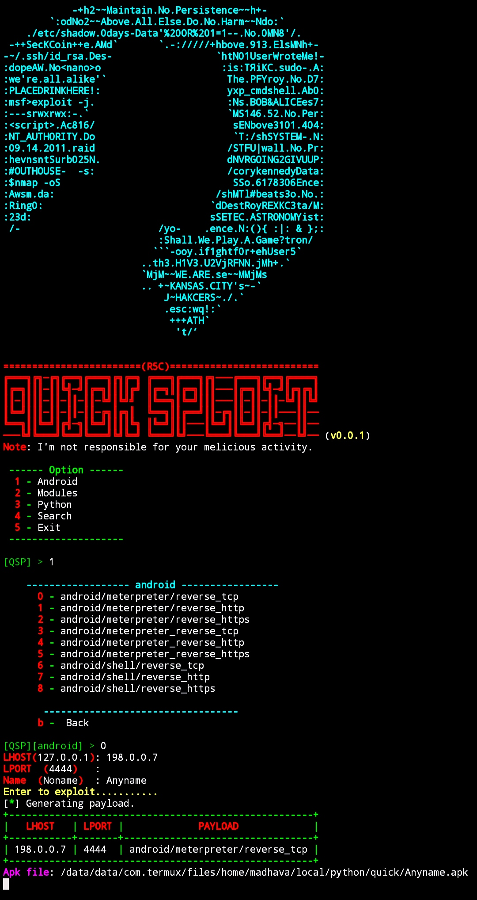

<body>Quick sploit</body>

Matasploit automation for Android.
<h4><u>Requirements</u>:</h4>
* Linux or Termux
* Python3
* Metasploit-framework 
* If not.it install autamatically 
<h4><u>Installation</u>:</h4>
`git clone https://github.com/Madhava-mng/Quick_sploit.git && cd Quick_sploit `
<h4 style="backgrond-color: Tomato;"><u>Screenshot</u>:</h4>

## Run:

> `$ cd Quick_sploit`

> `$ ./quick_sploit`
